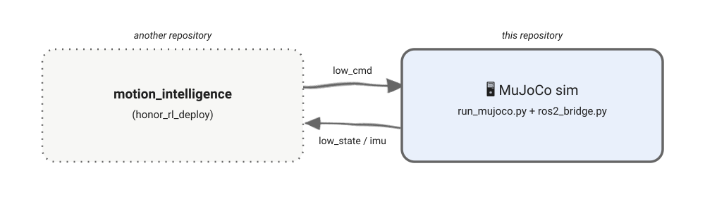

# Humanoid MuJoCo

<div align="center">

**VitaBoy 人形机器人的 MuJoCo 仿真——和真实机器人走同一套 ROS 2 话题，所以 [`honor_rl_deploy`](https://github.com/HonorRobotics/honor_rl_deploy) 能用同样的方式驱动它。**

[](https://www.python.org/)
[](https://docs.ros.org/en/humble/)
[](https://mujoco.org/)
[](https://releases.ubuntu.com/22.04/)

[English](readme.md) | [简体中文](readme_zh.md)

</div>

## ✨ 简介

本仓库在 MuJoCo 中仿真 VitaBoy 人形机器人，并通过 ROS 2 与其余组件通信，这样 C++ 推理仓库里跑的策略就能像驱动真实机器人一样驱动它。



### 特性

- **相同的 ROS 2 接口** — 和真机完全一致的话题，C++ 控制器无需改动即可驱动仿真和真机。
- **一条命令启动** — `run_mujoco.sh` 配好 uv 环境、source ROS 2，然后启动查看器（`honor_robot_sdk` 消息包需要先跑一次 `build_sdk_msgs.sh`）。
- **弹力带辅助** — 一根虚拟弹簧，在调策略时把机器人吊起来。
- **可配置** — 机器人、场景路径和循环周期都在 `scripts/config.py` 里。

## 📦 安装

### 要求

- Linux（Ubuntu 22.04）
- [uv](https://docs.astral.sh/uv/getting-started/installation/)
- [ROS 2 Humble](https://docs.ros.org/en/humble/Installation/Ubuntu-Install-Debs.html)

### 克隆项目

```bash
git clone https://github.com/HonorRobotics/honor_mujoco.git

git clone https://github.com/HonorRobotics/honor_robot_sdk.git
```

### 安装依赖

```bash
cd honor_mujoco

./scripts/install.sh
```

## 🚀 使用

### 启动 MuJoCo

```bash
cd honor_mujoco

source ./scripts/build_sdk_msgs.sh --honor-sdk /your_path/to_sdk

./scripts/run_mujoco.sh
```

### 查看器按键

弹力带是一根虚拟弹簧，在你调策略的时候把机器人吊起来。让查看器窗口保持焦点：


| 按键 | 作用                       |
| ---- | -------------------------- |
| `7`  | 缩短弹力带，把机器人往上提 |
| `8`  | 拉长弹力带，把机器人往下放 |
| `9`  | 开关弹力带                 |

> 💡 **提示：** 在 `scripts/config.py` 中设置 `ENABLE_ELASTIC_BAND = False` 可以完全禁用弹力带。

## 🛠️ 二次开发

```text
<workspace>/
└── honor_mujoco/
    ├── scripts/                # MuJoCo 仿真代码，需在该目录下运行
    │   ├── install.sh          # 检查 uv + ROS，创建 uv 环境，安装依赖
    │   ├── build_sdk_msgs.sh   # 编译并 source honor_robot_sdk/common 消息包
    │   ├── run_mujoco.sh       # 启动脚本：uv 环境 + ROS，然后跑 run_mujoco.py
    │   ├── run_mujoco.py       # 入口脚本：viewer 加上物理和渲染线程
    │   ├── ros2_bridge.py      # ROS 2 节点：接收关节指令，发布状态和 IMU
    │   └── config.py           # 机器人、场景路径和循环周期配置
    └── robots_assets/
        └── vita_boy/vita_boy1.0/     # 场景 XML 和网格模型
```

## 📄 许可证

本项目基于 [Apache License 2.0](LICENSE) 开源。
